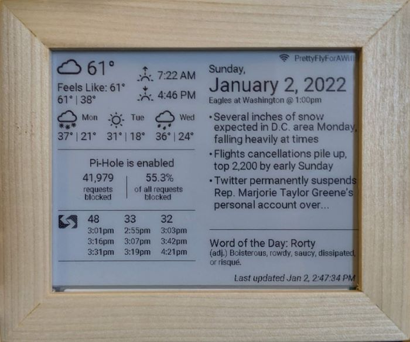

# Pi Display - Back End

Displays data on a Waveshare 5.83in e-ink display powered by a Raspberry Pi.

## Prerequisites

1. [Python 3.7+](https://www.python.org/downloads/)
1. Create API keys for all the data modules listed below that you want to utilize.
    * Weather: [OpenWeatherMap API](https://openweathermap.org/api/one-call-api)
    * News: [New York Times API](https://developer.nytimes.com/) and/or [Newsapi.org](https://newsapi.org/)
    * Word of the day: [Wordnik API](https://developer.wordnik.com/)
1. Get the Google Calendar id for the calendar that contains events you want to display. To find your calendar id:
    1. Go to your [Google Calendar settings](https://calendar.google.com/calendar/u/0/r/settings).
    1. Click your desired calendar on the left sidebar under "Settings for my calendars".
    1. Scroll down to the "Integrate calendar" section and copy the `Calendar ID`.
1. Set your secret keys in a `.env` file in the root `/pi-display` directory (note that the IP address for your Pi-Hole also needs to be stored):
    ```
    OWM_API_KEY=[open_weather_map_key]
    NYTIMES_API_KEY=[nytimes_api_key]
    NEWSAPI_API_KEY=[newsapi_api_key]
    WORDNIK_API_KEY=[wordnik_api_key]
    PIHOLE_ADDRESS=[ip_address_for_your_pihole]
    GOOGLE_CALENDAR_ID=[google_calendar_id]
    ```
1. Install the python-dotenv python dependency: `pip install python-dotenv`
1. Install the Pillow python dependency: `pip install Pillow`
1. Required for Google Calendar capabilities: Initialize your Google Calendar credentials and token.
    1. Note: the following instructions will allow your calendar to sync temporarily, but the Google authentication seems to expire rather quickly. More investigation is needed in order to have this work consistently.
    1. Follow *all* the directions listed in the `Prerequisites` section of the python [Google Calendar API quickstart guide](https://developers.google.com/calendar/api/quickstart/python). You must create a Google Cloud Platform project and OAuth desktop credentials.
    1. As part of the prerequisites above, you should have [created OAuth credentials](https://developers.google.com/workspace/guides/create-credentials#oauth-client-id) in the Google Cloud Console. Download and save the JSON credentials from the Google Cloud Console as `credentials.json` in the `python` directory of this project. To download the JSON file:
        1. Go to the [Google Cloud Console](https://console.cloud.google.com/). Make sure you have the correct project selected.
        1. In the left hamburger menu, select `APIs & Services` then `Credentials`.
        1. Under `OAuth 2.0 Client IDs`, click the `Download Auth Client` button for your desktop credentials.
        1. Click `DOWNLOAD JSON`
        1. Rename the downloaded file to `credentials.json` and move it to this `python` directory.
    1. Install the gcal libraries: `pip install --upgrade google-api-python-client google-auth-httplib2 google-auth-oauthlib`
    1. Run the initialization script. This only needs to be run on first install: `python google_cal_init.py`
        * Note: this requires browser access as you have to log in through the Google UI. If running your Pi headlessly, run this script on another computer and copy the `token.pickle` file that's generated to your Pi.
1. Required for Fast CLI capabilities: Install [Fast CLI](https://github.com/sindresorhus/fast-cli) cli (`npm install --global fast-cli`)

This project was specificially built for the [Waveshare 5.83inch e-Paper HAT](https://www.waveshare.com/wiki/5.83inch_e-Paper_HAT).

## Configuration

Some data module settings can be set in the root `settings.json` file. Use this file to enable/disable various data modules and adjust their settings. Default is all enabled. 

The data displayed is optained from the folowing sources:

### Google Calendar

The [Google Calendar API](https://developer.wordnik.com/) is used to display the next calendar event. Your Google Calendar ID needs to be set in the GOOGLE_CALENDAR_ID environment variable in order for this functionality to work.

#### Configuration Options

* `enabled`: Boolean to declare whether to get and display Google Calendar data

### News

The source for news headlines is set in the `config.py`. News can either be fetched from the New York Times API or News API. Set the `source` to `'nytimes'` to use the NY Times API or any [source ID from News API](https://newsapi.org/docs/endpoints/sources) to use the News API (ex. `'the-washington-post'`). 

#### New York Times API

News headlines can be retrieved from the [New York Times API](https://developer.nytimes.com/). Your NYTimes API key needs to be set in the NYTIMES_API_KEY environment variable in order for this functionality to work and the configuration's `source` needs to be set to `nytimes`.

#### News API

News headlines can also be retrieved from the [News API](https://newsapi.org/). Your News API key needs to be set in the NEWSAPI_API_KEY environment variable in order for this functionality to work and the configuration's `source` needs to be set to a [valid Newsapi source ID](https://newsapi.org/docs/endpoints/sources). Note: Articles are delayed a hour if you are using the free version.

#### Configuration Options

* `enabled`: Boolean to declare whether to get and display news headlines
* `source`: Source for the articles. Can be 'nytimes' or any [source ID from News API](https://newsapi.org/docs/endpoints/sources)
* `num`: Number of headlines to display

### OpenWeatherMap

Weather data is retrieved from the [OpenWeatherMap one call API](https://openweathermap.org/api/one-call-api). It includes current temperature, 3-day forecast, sunrise/sunset, and weather description (used to generate weather icon). Your OpenWeatherMap API key needs to be set in the OWM_API_KEY environment variable in order for this functionality to work. Default location is Philadelphia, PA.

#### Configuration Options

* `enabled`: Boolean to declare whether to get and display the weather information
* `lat`: Latitude for the weather location
* `lon`: Longitude for the weather location

The default latitude and longitude is Philadelphia, PA.

### Pi-Hole

The Pi-Hole status information is retrieved from the local [Pi-Hole API](https://discourse.pi-hole.net/t/pi-hole-api/1863). It includes current status (enabled/disabled), number of queries blocked, and percentage of queries blocked. Your Pi-Hole's IP address needs to be set in the PIHOLE_ADDRESS environment variable in order for this functionality to work.

#### Configuration Options

* `enabled`: Boolean to declare whether to get and display the Pi-Hole information

### Septa

The free [SEPTA api](https://www3.septa.org/) is used to retrieve the next arriving buses for the specified routes in the app settings. No API key is required.

#### Configuration Options

* `enabled`: Boolean to declare whether to get and display the word of the day
* `num`: The number of upcoming buses to display on the screen. Default is 4.
* `routes`: An array of bus route objects containing a bus `route` number and a `stop` id. Stop ids can be retrieved via the [SEPTA stops API](https://www3.septa.org/#/Static%20Data/Stops).

### Wordnik

[Wordnik](https://developer.wordnik.com/) is used to get the word of the day definition. Your Wordnik API key needs to be set in the WORDNIK_API_KEY environment variable in order for this functionality to work.

#### Configuration Options

* `enabled`: Boolean to declare whether to get and display the word of the day

## In Progress...

The following integrations are in the codebase but have not been implemented to print on the display.

### Fast CLI

Network speed information is run in local speed tests via the Fast CLI. This data is pretty slow to collect and the results don't seem very precise. 

#### Configuration Options

* `enabled`: Boolean to declare whether to calculate and display the network speed

## Run

To run the python program to retrieve and print the display data, run the command `python main.py` from the root folder.



## Linting

[autopep8](https://pypi.org/project/autopep8/) is used for Python linting. Install the `autopep8` VS Code extension for autoformatting in the IDE.

```
autopep8 --aggressive --aggressive --indent-size=2 --max-line-length=120 --ignore=E302 --ignore=E121 --in-place -v --recursive .
```

## Icons

Icons are from [Icons8](https://icons8.com).
