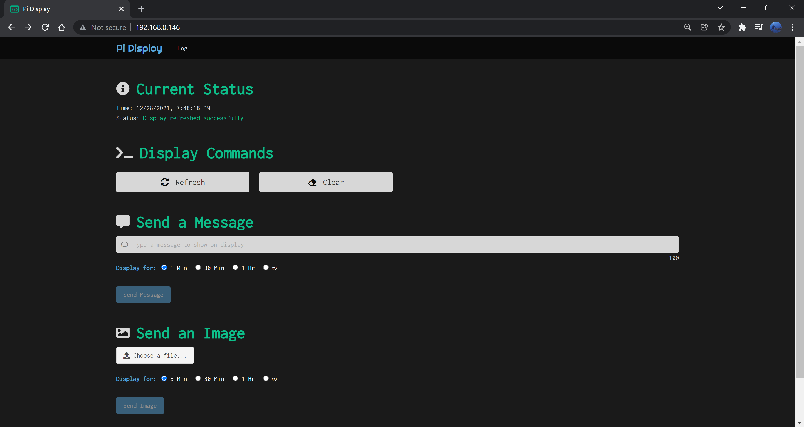

# Pi Display - Front End

This front end includes a React web app served through a node.js server.

## Requirements

* Node 16.13.0+

## Get Started

On first install, run `npm install`.

Run `npm run server` to build the project and start the node server or run `npm start` to start the development web app without the server.



## Google Calendar Integration

If you'd like to see your Google Calendar in this webapp, you will need to get the source URL for your calendar and add it to the project `.env` file:

1. Go to your settings in [Google Calendar](https://calendar.google.com/).
1. On the left side of the screen, click the name of the calendar you want to display.
1. (Optional) In the "Integrate calendar" section, under the "Embed code" field, click "Customize" and choose your custom options for the calendar widget.
1. In the "Integrate calendar" section, copy the value from the "Public URL to this calendar" field. It should look something like the following: `https://calendar.google.com/calendar/embed?src=a1bcdefghijklmnopqrs2tu3vw%40group.calendar.google.com&ctz=America%2FNew_York`

Note: if your calendar is not public, you will only be able to see it in the web app if you are already logged into your Google account.

You should have created a `.env` file in the project root during the [Python Prerequisites](../python/README.md#Prerequisites). Add the calendar source url you just retrieved to that root `.env` file:

```
GOOGLE_CALENDAR_URL=[google_calendar_url]
```

Once the url has been added to the `.env`, you will need to rebuild the project. You should then see the "Calendar" link in the nav and be able to access the calendar page successfully.